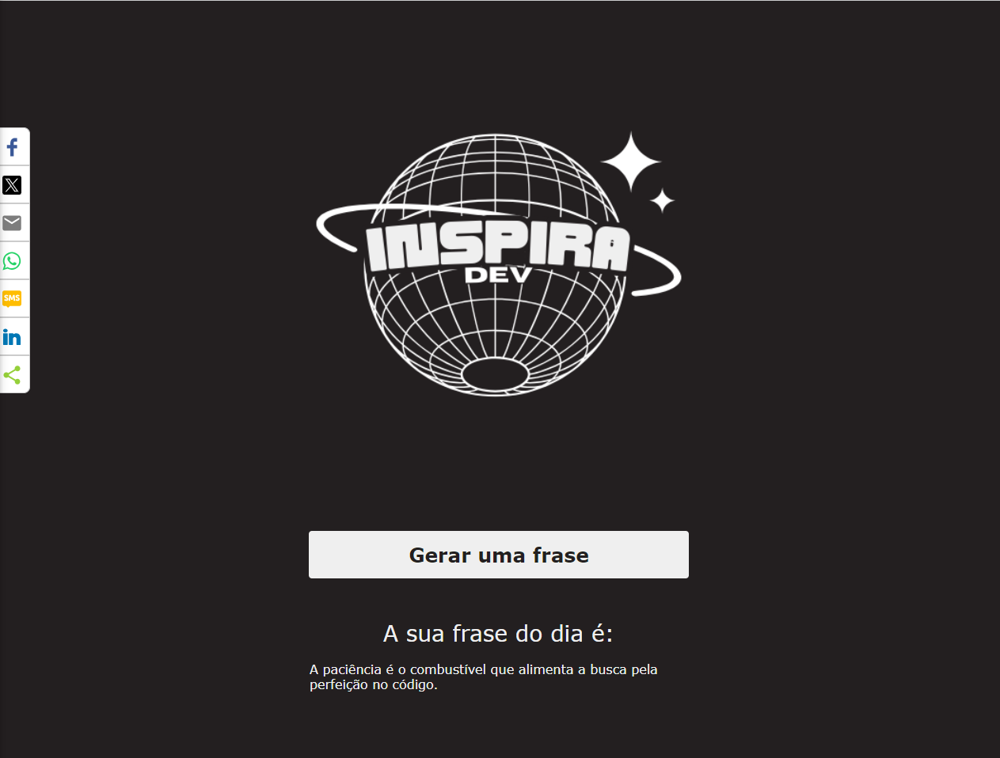
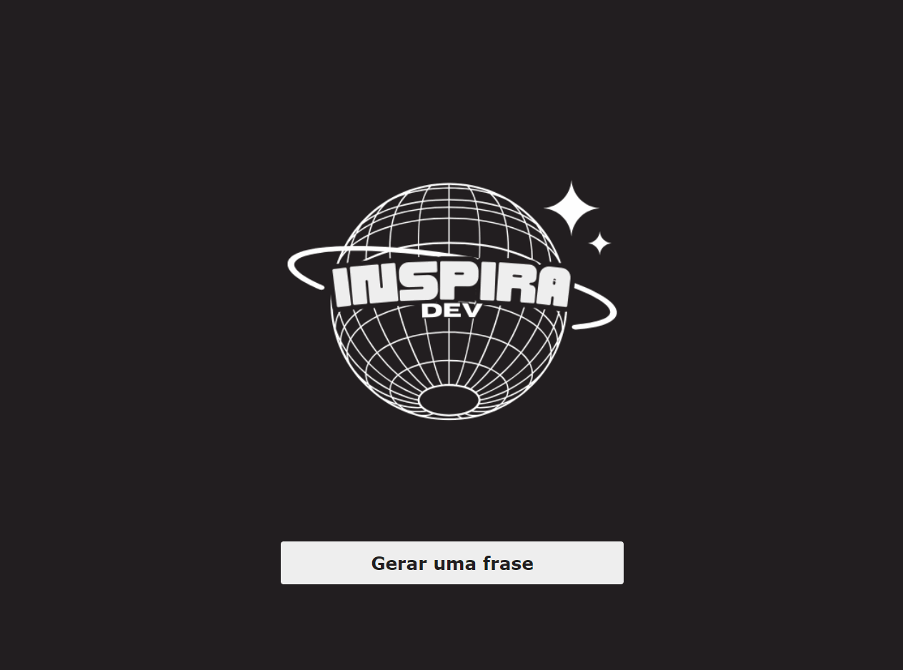

📝 ##Descrição
A ideia desse site surgiu após perceber que assim como eu, diversas pessoas adoram frases motivacionais. Por isso, pensei em ter um site onde todo dia, você pudesse gerar uma nova frase que inspirasse a continuar programando.

📚 ##Funcionalidades
O site possui frases prá-cadastradas no banco de dados. Ao clicar em gerar uma frase, ele randomicamente pega do banco de dados e exibe na tela. Há também botões laterais para facilitar o compartilhamento da frase nas redes sociais.

Meu grande objetivo e desafio nesse projeto era usar minhas habilidades em back end conseguir integrar com a parte visual, o front-end. 

🔧 ##Tecnologias utilizadas
Node.js, Express, postgresql, nodemon, cors, HTML e CSS.

🚀 ##Como funciona:

